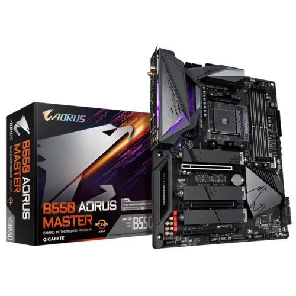

OpenCore 0.8.8, macOS Ventura 13.4

# Confirmed
- [x] Wifi
- [x] Bluetooth
- [x] USB
- [ ] Audio
- [ ] Sleep

# Setup
- OS: 13.4(22F66)
- CPU: AMD Ryzen 5 3600 6-Core
- Mainboard: GIGABYTE B550 Aorus Master
- BIOS: F16c
- WIFI: Onboard AX200
- Bluetooth: Due to the bug on this mainboard, I used a seperate AX210 PCIE card
- GPU: SAPPHIRE Radeon RX 560 4GB

# ACPIs
- SSDT-CPUR.aml
- SSDT-EC-USBX-DESKTOP.aml

# Product Name
- MacPro7,1

# KEXTs
- usbtoolbox
- utbmap
- amdryzencpupowermanagement
- applealc
- smcamdprocessor
- hibernationfixup
- itlwm
- intelbluetoothfirmware
- intelbtpather
- bluetoolfixup (patched due to the bug on Ventura, see here: https://github.com/OpenIntelWireless/itlwm/issues/878#issuecomment-1575595326)
